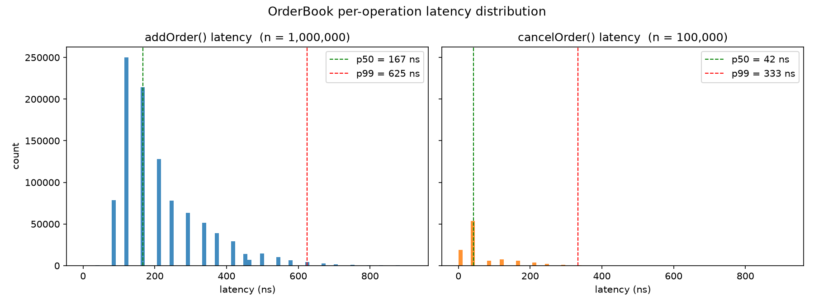

# Low-Latency Order Book Matching Engine

A from-scratch limit order book matching engine in C++, implementing the core data
structures used in real trading systems and enforcing strict **price-time priority**.
Benchmarked at **4.3M `addOrder`/sec with sub-microsecond p99 latency** on a single thread.

## Project layout

```
.
├── src/
│   ├── OrderBook.h        # engine interface
│   ├── OrderBook.cpp      # matching logic + data structures
│   └── main.cpp           # small scripted demo (add / match / cancel)
├── bench/
│   └── benchmark.cpp      # per-operation latency + throughput benchmark
├── scripts/
│   └── plot_latency.py    # renders histogram + CDF from benchmark CSVs
├── docs/img/              # generated latency plots (checked in for the README)
├── demo/                  # browser walkthrough (same matching rules)
├── Makefile
└── README.md
```

## Architecture

The engine layers three data structures:

```
Price Level Map (Red-Black Tree)
  └── 101.00 → [Order A] ↔ [Order B] ↔ [Order C]   (Doubly Linked List)
  └── 100.50 → [Order D]
  └── 100.00 → [Order E] ↔ [Order F]

Order Lookup (Hash Map)
  └── order_id → OrderNode*   (O(1) pointer directly into the DLL)
```

- **`std::map` (Red-Black Tree)** — keeps price levels sorted (bids descending, asks
  ascending). Best bid/ask is `O(1)` via `.begin()`; a new price level is `O(log P)`.
- **Custom `PriceLevel` (Doubly Linked List)** — FIFO queue of orders at one price.
  Appending is `O(1)` via a tail pointer; removing any order mid-queue is `O(1)`.
- **`std::unordered_map` (Hash Map)** — maps each live `order_id` to its `OrderNode*`,
  so `cancelOrder` skips the tree and splices the node out in `O(1)`.

## Complexity

| Operation                    | Data Structure                    | Time       |
| ---------------------------- | --------------------------------- | ---------- |
| `addOrder` (no match)        | Red-Black Tree + DLL tail insert  | O(log P)   |
| `addOrder` (with match)      | Red-Black Tree + DLL head pop     | O(log P) per fill |
| `cancelOrder`                | Hash Map + DLL pointer splice     | O(1) avg   |
| Best bid/ask lookup          | Red-Black Tree `.begin()`         | O(1)       |

*P = number of distinct price levels in the book.*

## Performance

Benchmarked on **Apple M2 (8 GB RAM, macOS)**, single-threaded, `g++ -O2 -std=c++17`.
Workload: 100K-order warmup, then 1M random `addOrder` + 100K `cancelOrder` calls
(seeded RNG, prices uniform in [99.00, 101.00], ~10% match rate).

| Operation       | mean   | p50    | p99    | p99.9   | throughput      |
| --------------- | ------ | ------ | ------ | ------- | --------------- |
| `addOrder()`    | 232 ns | 167 ns | 625 ns | 1.88 µs | 4.3M ops/sec    |
| `cancelOrder()` | 70 ns  | 42 ns  | 333 ns | 1.21 µs | 14.2M ops/sec   |
| **Aggregate**   |        |        |        |         | **3.66M ops/sec** |



*`p99.9` is dominated by allocator slow paths; a pooled allocator for `OrderNode` is the
natural next step to flatten the tail.*

## Demo

The browser demo uses the same price-time priority rules as the C++ engine: a limit that does not cross rests in a FIFO queue, a crossing order prints at the maker’s price, and cancels splice a live order out of its queue.

- Live book: https://anuragband-07.github.io/low-latency-order-book/demo/
- Walkthrough video: https://anuragband-07.github.io/low-latency-order-book/demo/watch.html

`demo/index.html` also opens locally, with no build step.

## Build & run

```bash
make            # builds ./build/demo and ./build/benchmark
make run-demo   # runs the scripted add/match/cancel demo
make run-bench  # runs the latency benchmark (writes *.csv to repo root)
make plots      # regenerates docs/img/ plots (needs numpy, pandas, matplotlib)
```

## Design notes & roadmap

- **Single-threaded by design.** Multi-threading an order book requires a sequencing
  layer (e.g. an LMAX Disruptor-style ring buffer) to preserve price-time priority.
- **Roadmap:** pooled `OrderNode` allocator to cut tail latency, `modifyOrder` support,
  and a market-data feed replay harness.
